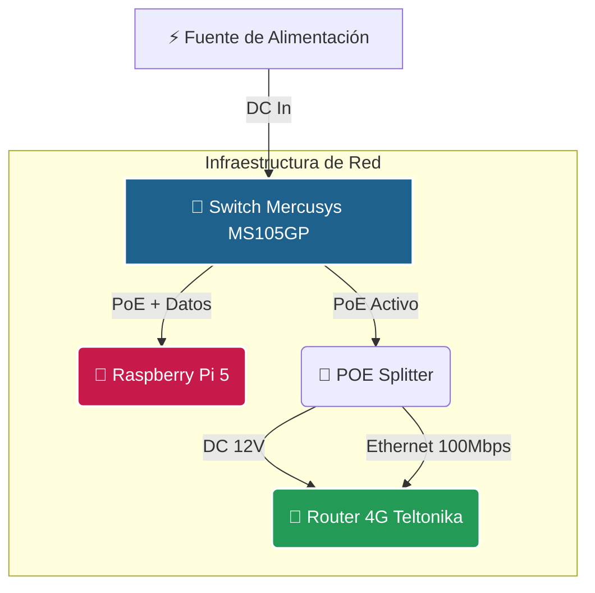

# 📡 RPi 5 + Tailscale + NoMachine: Optimización Low-Bandwidth

> **Objetivo del Proyecto:** Lograr un escritorio remoto con interfaz gráfica **fluida y estable** en entornos críticos donde la velocidad de internet no supera los **5 Mbps** simétricos, utilizando la eficiencia de Tailscale y el protocolo NX de NoMachine.

---

## 🗺️ Topología de Red y Energía

El siguiente esquema ilustra la distribución de energía (PoE) y el flujo de datos. El Switch actúa como el núcleo de la infraestructura.

---

## ⚙️ Especificaciones de Hardware

### 1. 📶 Router Teltonika **RUT200**
El punto de entrada de internet 4G. Se han identificado las siguientes limitaciones físicas que definen el techo de rendimiento:

| Componente | Especificación | Limitación / Impacto |
| :--- | :--- | :--- |
| **Módulo LTE** | Cat 4 | Máx teórico: 150 Mbps DL / 50 Mbps UL. |
| **Wi-Fi** | 802.11 b/g/n (2.4GHz) | Saturación y menor ancho de banda local. |
| **Ethernet** | 2x Puertos 10/100 | **⚠️ Cuello de botella principal:** Limita la LAN a 100 Mbps. |
| **RAM** | 128 MB | Limita el uso de servicios pesados internos (Docker, etc). |

#### 📡 Antenas (Teltonika PR1US440)
* **Ganancia:** 4 dBi
* **Frecuencias:** 698–960 MHz / 1710–2690 MHz
* **Conexión:** SMA Male (Polarización Lineal)

---

### 2. 🔌 POE Converter **PS5724AT-RJ** (Splitter)
Elemento crítico para eliminar fuentes de alimentación redundantes. Convierte el estándar PoE (48V) a 12V para el router.

* **SN:** `07255724AT4228`
* **Velocidad:** 10/100 Mbps

> **⚠️ Advertencia de Calidad:**
> El cable integrado de este convertidor carece de documentación técnica oficial.
> * **Riesgo:** Posible inducción de ruido eléctrico o inestabilidad en la negociación de enlace.
> * **Impacto:** Si la conexión fluctúa, este cable es el primer punto de falla a revisar.

---

### 3. 🔀 Switch Mercusys **MS105GP**
El nodo central que gestiona el tráfico y la energía.

* **Capacidad:** 5 Puertos Gigabit (4 PoE+).
* **Configuración de Interruptores Físicos:**

| Modo | Estado Recomendado | Razón |
| :--- | :--- | :--- |
| **Extend** | ❌ **OFF** (Apagado) | Al activarlo, reduce la velocidad a **10 Mbps**. Solo usar si el cable supera los 100m. |
| **Isolation** | ❌ **OFF** (Apagado) | Al activarlo, impide que los dispositivos se vean entre sí (RPi no vería al Router). |

---

### 4. 🍓 Raspberry Pi 5 (4GB)
El cerebro de la operación. Gracias a su interfaz Gigabit, su conexión con el Switch es perfecta, aunque estará limitada a la velocidad de salida del Router 4G hacia internet.

* **Conectividad:** Gigabit Ethernet / Wi-Fi 5 (ac).
* **Rol:** Servidor de escritorio remoto y Exit Node.
