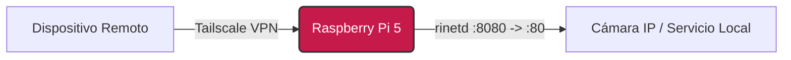

# 🍓 Raspberry Pi 5 — Subnetting con `rinetd`


> **Resumen:** Guía para configurar el redireccionamiento de puertos (Port Forwarding) eficiente mediante `rinetd` a través de un túnel **Tailscale**.

---

## 📋 Introducción

Esta configuración permite crear un puente ligero entre la interfaz de Tailscale y un servicio local (como una cámara IP, un servidor web interno o un dashboard) que reside en la misma red que la Raspberry Pi, pero que no tiene Tailscale instalado nativamente.

**Beneficio:** Generamos una conexión remota al servicio local optimizando el ancho de banda y mejorando la fluidez del stream.



---

## 🛠️ 1. Instalación
Primero, actualizamos los repositorios e instalamos el demonio `rinetd`.

```bash
sudo apt update && sudo apt install rinetd -y
```

---

## ⚙️ 2. Configuración del Reenvío (Forwarding)

Editaremos el archivo de configuración principal.

```bash
sudo nano /etc/rinetd.conf
```

Añade la siguiente línea al final del archivo. Esta línea define la regla de "mapeo" de puertos:

```conf
# bindaddress  bindport  connectaddress  connectport
0.0.0.0        8080      192.168.1.148   80
```

### 🔍 Desglose de parámetros

| Parámetro | Valor | Descripción |
| :--- | :--- | :--- |
| **Bind Address** | `0.0.0.0` | Indica que `rinetd` escuchará en **todas** las interfaces de red disponibles (incluida la interfaz virtual de Tailscale). |
| **Bind Port** | `8080` | Es el puerto de entrada en la Raspberry Pi. Usarás este puerto en tu navegador remoto. |
| **Target IP** | `192.168.1.148` | **(Ejemplo)** La dirección IP local del dispositivo objetivo (ej. tu Cámara PTZ o servidor web). |
| **Target Port** | `80` | El puerto donde el dispositivo objetivo sirve su contenido (página web de la cámara). |

---

## 🚀 3. Aplicar Cambios

Guarda el archivo (`Ctrl + O`, `Enter`) y sal (`Ctrl + X`). Luego, reinicia el servicio para cargar la nueva configuración:

```bash
sudo service rinetd restart
```

---

## 🔧 Troubleshooting

Ya deberías poder acceder a tu dispositivo de forma remota utilizando la IP de Tailscale de tu Raspberry Pi:

> 🔗 **URL:** `http://<TU_IP_TAILSCALE>:8080`

### ¿No conecta?
Si la conexión falla, es probable que el firewall (UFW) esté bloqueando el puerto `8080`. Habilítalo con:

```bash
sudo ufw allow 8080/tcp
```
